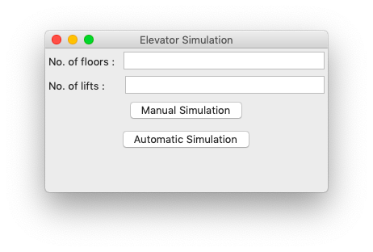
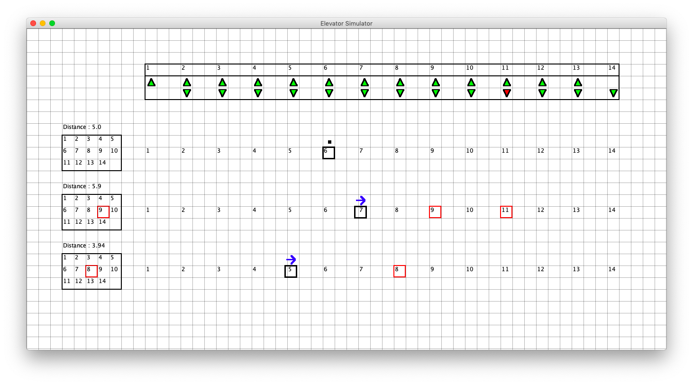

# Elevator Simulator

Elevator Simulator is a graphical tool to simulate working of a system of elevators in a multi-storied building, written in functional programming language Racket. It implements a scheduling algorithm to assign stops to elevators based on real time user input aiming to minimise waiting time for users.

It also includes an automatic simulation module that randomly simulates button presses by users and assign stops to elevators, simultaneously calculating distance traveled by each elevator in the system. This helps to find out optimum number of elevators required to serve a building with given number of floors and use frequency.

## Project Structure

1. **declarations.rkt** : This file contains the initial conditions required for the simulation, e.g. time taken by lift to travel or stop, number of lifts or floors, etc.

2. **classes.rkt** :- This is the file containing the classes for lift and buttons, along with implementation of scheduling algorithm.

3. **GUI.rkt** : This file contains the complete implementation of the GUI created for the elevators and the respective buttons inside the elevator and on the floors. It makes an extensive grid with clickable boxes as buttons for the lifts.

4. **main.rkt** : Main file to generate GUI, take input and run the project.

5. **automator.rkt** : Implementation of the automatic simulation module.

## Running the Project

Open main.rkt in DrRacket and run the program. Following popup will appear asking for number of floors and lifts.

Automatic Simulation will run the simulation in background and display the distances travelled by each lift. Manual simulation will open the following interface allowing user to interact with the system.

- The black box represents the lift with red boxes as its stops
- The panel on left of a lift has clickable buttons to represent buttons inside a lift
- The panel on top has clickable buttons to represent buttons on various floors to call a lift

## Bugs and Limitations

- GUI unable to handle large number of floors and lifts
- Time for which a lift stops on a floor is assumed to be constant
- Automated simulation is completely random and doesn't account for popularity of some specific floors like 1st